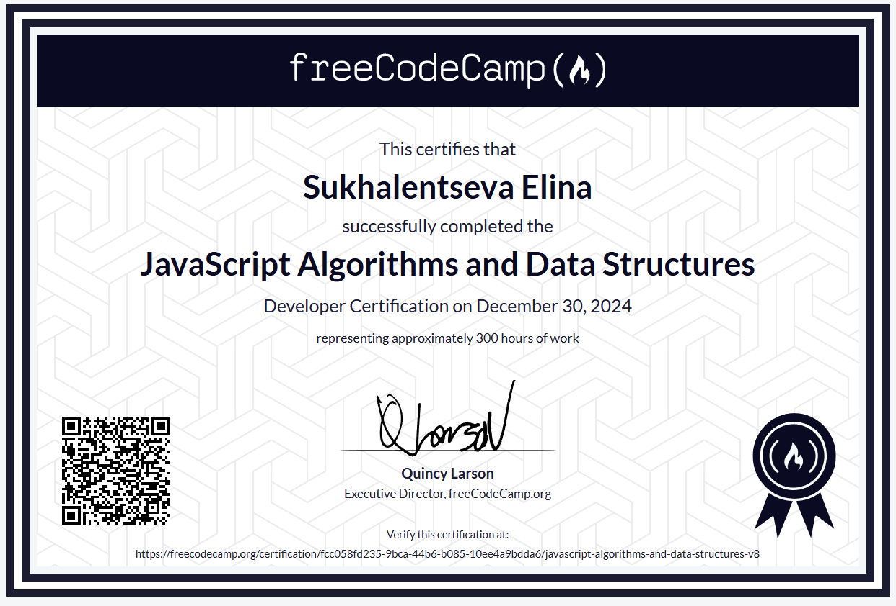
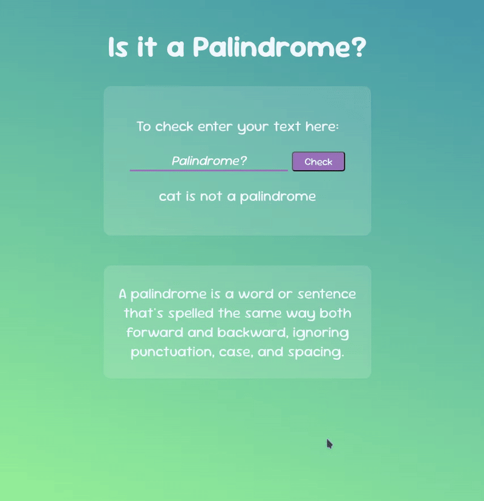

Built in 2024 to showcase my first projects and mark the completion of this learning journey.

A palindrome checker application — the **first project** in FreeCodeCamp's JavaScript Algorithms and Data Structures certification. Built to detect whether a given string reads the same forwards and backwards, ignoring punctuation, case, and spacing.

The project only consists of **JavaScript** + **HTML** + **CSS** and was made as a part of FreeCodeCamp's JavaScript Algorithms and Data Structures course.

>[My official FCC's Certificate](https://www.freecodecamp.org/certification/fcc058fd235-9bca-44b6-b085-10ee4a9bdda6/javascript-algorithms-and-data-structures-v8)

---
## 📋 Project Requirements

This project fulfills all **16 user stories** from FreeCodeCamp's "Build a Palindrome Checker" challenge:

<b>Click to expand the full requirements</b>

 

**User Stories:**
- [x] `input` element with `id="text-input"`
- [x] `button` element with `id="check-btn"`
- [x] `div`, `span`, or `p` element with `id="result"`
- [x] Clicking `#check-btn` with empty input shows alert: `"Please input a value"`
- [x] `"A"` → `"A is a palindrome"`
- [x] `"eye"` → `"eye is a palindrome"`
- [x] `"_eye"` → `"_eye is a palindrome"`
- [x] `"race car"` → `"race car is a palindrome"`
- [x] `"not a palindrome"` → `"not a palindrome is not a palindrome"`
- [x] `"A man, a plan, a canal. Panama"` → `"... is a palindrome"`
- [x] `"never odd or even"` → `"... is a palindrome"`
- [x] `"nope"` → `"nope is not a palindrome"`
- [x] `"almostomla"` → `"almostomla is not a palindrome"`
- [x] `"My age is 0, 0 si ega ym."` → `"... is a palindrome"`
- [x] `"1 eye for of 1 eye."` → `"... is not a palindrome"`
- [x] `"0_0 (: /-\ :) 0-0"` → `"... is a palindrome"`
- [x] `"five|\_/|four"` → `"... is not a palindrome"`

**All tests passed** ✅

---

## 🎨 About the Project

The first project I built using JS for FCC's Javascript course. It checks if the string in the input is written the same way from the left and from the right - in other words, the palindrome! 
Each project in that course took me a lot of time to accomplish. I remember googling and reading how others solved the tasks from the project requirements and trying to recreate it.

<i>submitted to FreeCodeCamp on Nov 12, 2024</i>

---

## 🔗 Live Demo

---

*Part of my [FreeCodeCamp journey](https://www.freecodecamp.org/certification/fcc058fd235-9bca-44b6-b085-10ee4a9bdda6/javascript-algorithms-and-data-structures-v8)*

